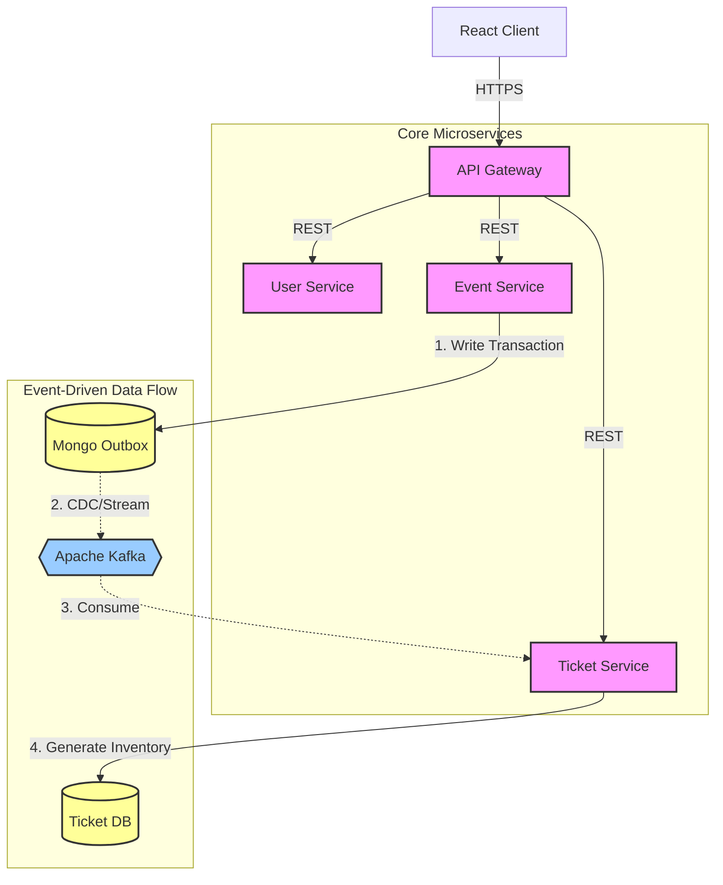
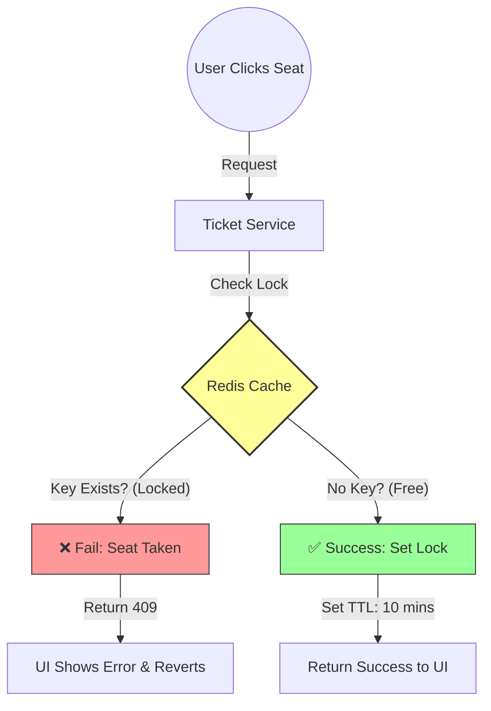

# Distributed Event Ticketing System

> **Status:** Active Development / Beta

This is a scalable, microservices-based ticketing platform designed to handle high-concurrency booking scenarios. Built with **Go (Golang)** and **Kafka**, it utilizes an Event-Driven Architecture to decouple core services and ensure data consistency across distributed systems.

**Key Highlight:** The system implements a robust **Distributed Locking Mechanism** using Redis to handle the "Thundering Herd" problem during high-demand ticket sales, ensuring that no seat is double-booked even when thousands of users click simultaneously.

---

## Tech Stack

* **Backend:** Go (Golang), Gin Framework
* **Frontend:** React.js, Tailwind CSS
* **Messaging:** Apache Kafka, Outbox Pattern
* **Database:** MongoDB (Event/Ticket Data), **Redis (Active Distributed Locking)**
* **Infrastructure:** Docker, Railway/Render (Cloud Deployment)
* **Architecture:** Microservices, API Gateway, Centralized Config Module

---

## System Architecture

The system is composed of loose-coupled microservices communicating via REST (Synchronous) and Kafka (Asynchronous).

### **1. High-Level Data Flow**

### **2. Concurrency Control: The Seat Locking Flow**

To handle race conditions (e.g., 500 users trying to book "Seat A1" at the exact same millisecond), the system uses a **Redis-First** approach.

---

### **Key Architectural Patterns**

1. **Transactional Outbox Pattern:**
* To ensure data consistency between MongoDB and Kafka, event creation does not write directly to the message bus.
* Instead, event data is written to an `outbox` collection within the same database transaction.
* A CDC or background worker then streams these records to Kafka, guaranteeing **At-Least-Once delivery** to the Ticket Service.

2. **Redis Distributed Locking (Concurrency Core):**
* **Problem:** Database transactions are too slow to handle thousands of concurrent "book" requests.
* **Solution:** We intercept the booking request at the cache level.
* Using Redis `SETNX` (Set if Not Exists), we create an **Atomic Lock**. Only one request can succeed in setting this key.
* All subsequent requests fail instantly without hitting the primary database, protecting the database from load and ensuring zero double-bookings.

3. **Centralized API Gateway:**
* Acts as the single entry point for all client requests.
* Handles routing to appropriate downstream services (Auth, Event, Ticket).
* Internal microservices communicate via the Gateway URL to abstract service discovery.

---

## Key Features

### **1. Authentication & Security**

* **Dual-Token Architecture:** implemented `Access Token` (short-lived) and `Refresh Token` (long-lived) flow.
* **Frontend Interceptor:** Axios interceptors automatically attach tokens to requests and handle silent token refresh on 401 Unauthorized errors.

### **2. Event & Ticket Management**

* **API-First Design:** Events are created via secure API endpoints.
* **Async Ticket Generation:**
* When an Admin creates an Event, the **Event Service** publishes a message via the Outbox pattern.
* The **Ticket Service** consumes this event and asynchronously generates the inventory (Categories, Sections, Seats).

### **3. Smart Booking Flow**

* **Real-Time Locking:** As users select seats on the React frontend, individual calls are made to "reserve" the seat in Redis for a specific duration (e.g., 10 minutes).
* **Cart Validation:** Before proceeding to checkout, the system validates that the user still holds valid locks for all selected seats.
* **Optimistic UI:** The frontend assumes success but instantly reverts the UI if the backend reports a lock conflict.

---

## Project Roadmap & Status

| Feature / Module | Status | Technical Detail |
| --- | --- | --- |
| **User Authentication** | Completed | JWT, Refresh Rotation, Middleware |
| **API Gateway** | Completed | Reverse Proxy, Request Routing |
| **Event Creation** | Completed | MongoDB Transaction, Outbox Pattern |
| **Ticket Generation** | Completed | Kafka Consumer Group |
| **Inventory Browsing** | Completed | Categories & Sections APIs |
| **Seat Locking** | **Completed** | **Redis SETNX (Atomic Locking) + TTL** |
| **Payment Integration** | Planned | Razorpay/Stripe API Mock |
| **Final Booking** | Planned | Permanent MongoDB Update after Payment Success |
| **Seat Map UI** | In Progress | React Grid, Optimistic Updates |

---

## Microservices Overview

This system relies on the following distributed services:

| Service Name | Type | Key Responsibility |
| --- | --- | --- |
| **`api-gateway`** | Entry Point | Reverse Proxy, JWT Validation, Request Routing |
| **`auth-service`** | Core Domain | User Identity, Access/Refresh Token Management |
| **`event-service`** | Core Domain | Event Metadata, Outbox Transaction Handling |
| **`ticket-service`** | Consumer | Kafka Consumer, Redis Locking, Inventory Management |
| **`common-module`** | Library | Shared Kafka Configs, Middleware, Error Constants |
