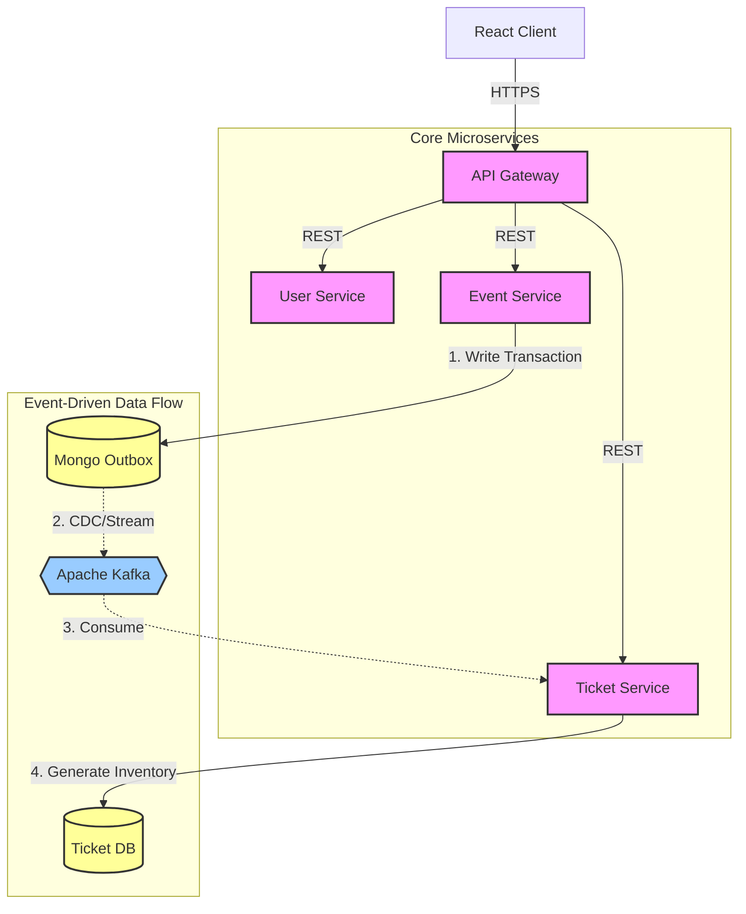

# Distributed Event Ticketing System

> **Status:** Active Development / Beta

This is a scalable, microservices-based ticketing platform designed to handle high-concurrency booking scenarios. Built with **Go (Golang)** and **Kafka**, it utilizes an Event-Driven Architecture to decouple core services and ensure data consistency across distributed systems.

---

## Tech Stack

- **Backend:** Go (Golang), Gin Framework
- **Frontend:** React.js, Tailwind CSS
- **Messaging:** Apache Kafka, Outbox Pattern
- **Database:** MongoDB (Event/Ticket Data), Redis (Planned for Locking)
- **Infrastructure:** Docker, Railway/Render (Free Tier Deployment)
- **Architecture:** Microservices, API Gateway, Centralized Config Module

---

## System Architecture

The system is composed of loose-coupled microservices communicating via REST (Synchronous) and Kafka (Asynchronous).

### **High-Level Design**

### **Key Architectural Patterns**

1. **Transactional Outbox Pattern:**

- To ensure data consistency between MongoDB and Kafka, event creation does not write directly to the message bus.
- Instead, event data is written to an `outbox` collection within the same database transaction.
- A connector/relay then streams these records to Kafka, guaranteeing **At-Least-Once delivery** to the Ticket Service.

2. **Centralized API Gateway:**

- Acts as the single entry point for all client requests.
- Handles routing to appropriate downstream services (Auth, Event, Ticket).
- Internal microservices communicate via the Gateway URL to abstract service discovery.

3. **Shared 'Common' Module:**

- A custom Go library that standardizes Kafka configuration, Producers, and Consumers.
- Ensures consistent error handling and connection logic across all microservices.

---

## Key Features

### **1. Authentication & Security**

- **Dual-Token Architecture:** implemented `Access Token` (short-lived) and `Refresh Token` (long-lived) flow.
- **Frontend Interceptor:** Axios interceptors automatically attach tokens to requests and handle silent token refresh on 401 Unauthorized errors.

### **2. Event & Ticket Management**

- **API-First Design:** Events are created via secure API endpoints.
- **Async Ticket Generation:**
- When an Admin creates an Event, the **Event Service** publishes a message via the Outbox pattern.
- The **Ticket Service** consumes this event and asynchronously generates the inventory (Categories, Sections, Seats).

### **3. Booking Flow (Discovery)**

- Hierarchical browsing of inventory:
- **Select Event** -> **View Categories** -> **View Sections** -> **Select Seats** (In Progress).

- Efficient aggregation of seat availability status.

---

## Project Roadmap & Status

| Feature / Module        | Status      | Technical Detail                                 |
| ----------------------- | ----------- | ------------------------------------------------ |
| **User Authentication** | Completed   | JWT, Refresh Rotation, Middleware                |
| **API Gateway**         | Completed   | Reverse Proxy, Request Routing                   |
| **Event Creation**      | Completed   | MongoDB Transaction, Outbox Pattern              |
| **Ticket Generation**   | Completed   | Kafka Consumer Group                             |
| **Inventory Browsing**  | Completed   | Categories & Sections APIs                       |
| **Seat Map UI**         | In Progress | HTML5 Canvas / Grid Rendering                    |
| **Concurrency Control** | Planned     | Redis Distributed Locks + Pessimistic DB Locking |
| **Payments**            | Planned     | Mocked Payment Gateway                           |

---

## Microservices Overview

- **`api-gateway`**: Entry point and router.
- **`user-service`**: User management and token generation.
- **`event-service`**: Manages event metadata and the Outbox table.
- **`ticket-service`**: Consumes Kafka events to generate tickets; manages inventory.
- **`common-module`**: Shared library for Kafka config and generic helpers.

